# jink 示例

> 基于 ink 官方示例的 jink (Java) 等效实现，并包含 jink 原有功能展示 Demo。

## 运行方式

**先编译**（只需运行一次，或代码有改动时重新运行）：

```powershell
mvn test-compile
```

**交互式菜单选择 Demo**（推荐）：

```powershell
.\scripts\run.ps1        # PowerShell
scripts\run.cmd          # CMD
./scripts/run.sh         # Bash (Linux/macOS)
```

**直接运行指定 Demo**：

```powershell
.\scripts\run-demo.ps1 io.mybatis.jink.demo.Counter
```

---

## ink 官方示例对照

| 示例 | ink 原版 | jink 实现 | 状态 | 说明 |
|:-----|:---------|:----------|:-----|:-----|
| counter | ✅ | ✅ `Counter.java` | ✅ 完整 | 自动递增计数器（每 100ms，上限 100 次）|
| borders | ✅ | ✅ `BordersDemo.java` | ✅ 完整 | 所有边框样式展示 |
| box-backgrounds | ✅ | ✅ `BoxBackgroundsDemo.java` | ✅ 完整 | 背景色用法（RGB/Hex/嵌套继承）|
| justify-content | ✅ | ✅ `JustifyContentDemo.java` | ✅ 完整 | 所有 justifyContent 对齐方式 |
| use-input | ✅ | ✅ `UseInputDemo.java` | ✅ 完整 | 方向键移动小脸，q 退出 |
| terminal-resize | ✅ | ✅ `TerminalResizeDemo.java` | ✅ 完整 | 实时终端尺寸显示，resize 即更新 |
| static | ✅ | ✅ `StaticDemo.java` | ✅ 完整 | Static 增量渲染（10 个测试逐条打印）|
| incremental-rendering | ✅ | ✅ `IncrementalRenderingDemo.java` | ✅ 完整 | 高频渲染：进度条 + 日志 + 服务列表 |
| chat | ✅ | ✅ `ChatDemo.java` | ✅ 完整 | 简单聊天输入框 |
| use-focus | ✅ | ✅ `UseFocusDemo.java` | ⚠️ 部分 | ↑/↓ 方向键焦点导航（Tab 被框架拦截，改用方向键）|
| table | ✅ | ✅ `TableDemo.java` | ✅ 完整 | 固定宽度列表格 |
| jest | ✅ | ✅ `JestDemo.java` | ✅ 完整 | 并发测试运行器模拟（Static + 进度）|
| subprocess-output | ✅ | ✅ `SubprocessOutputDemo.java` | ✅ 完整 | ProcessBuilder 执行 java -version |
| router | ✅ | ✅ `RouterDemo.java` | ✅ 完整 | 状态机路由（Home ↔ About）|
| select-input | ✅ | ✅ `SelectInputDemo.java` | ⚠️ 部分 | 方向键列表选择（无 ARIA 支持）|
| cursor-ime | ✅ | ✅ `CursorImeDemo.java` | ✅ 完整 | 光标跟随输入（含宽字符计算）|
| suspense | ✅ | ❌ 无 | ❌ 不支持 | React Suspense 无 Java 等效 |
| concurrent-suspense | ✅ | ❌ 无 | ❌ 不支持 | React 并发模式无 Java 等效 |
| aria | ✅ | ❌ 无 | ❌ 不支持 | ARIA 辅助功能暂不支持 |
| use-stdout / use-stderr | ✅ | — | — | Java System.out/err 直接可用，无需特殊封装 |
| render-throttle | ✅ | — | — | jink 内部已做节流，无需示例 |
| use-transition | ✅ | ❌ 无 | ❌ 不支持 | React useTransition 无 Java 等效 |

---

## jink 原有 Demo

| Demo | 说明 | 交互性 | 运行命令 |
|:-----|:-----|:------|:---------|
| `SimpleDemo` | 静态渲染，展示布局和样式 | 无 | `.\scripts\run-demo.ps1 io.mybatis.jink.demo.SimpleDemo` |
| `InteractiveDemo` | 消息列表，键盘导航 | ✅ | `.\scripts\run-demo.ps1 io.mybatis.jink.demo.InteractiveDemo` |
| `CopilotDemo` | 完整 Copilot CLI 复刻 | ✅ | `.\scripts\run-demo.ps1 io.mybatis.jink.demo.CopilotDemo` |
| `CopilotDemoPreview` | CopilotDemo 静态预览 | 无 | `.\scripts\run-demo.ps1 io.mybatis.jink.demo.CopilotDemoPreview` |
| `InputDiagnostic` | 诊断方向键/滚轮/ESC 序列 | ✅ | `.\scripts\run-demo.ps1 io.mybatis.jink.demo.InputDiagnostic` |
| `FeatureShowcase` | 综合功能展示（4 个标签页）| ✅ | `.\scripts\run-demo.ps1 io.mybatis.jink.demo.FeatureShowcase` |
| `PromptDemo` | 选项列表 + 自由输入交互提示 | ✅ | `.\scripts\run-demo.ps1 io.mybatis.jink.demo.PromptDemo` |
| `TopDemo` | 类似 top/htop 的系统监控 TUI | ✅ | `.\scripts\run-demo.ps1 io.mybatis.jink.demo.TopDemo` |
| `MazeDemo` | 控制台迷宫游戏（Prim 算法，自适应尺寸）| ✅ | `.\scripts\run-demo.ps1 io.mybatis.jink.demo.MazeDemo` |

---

## 各示例详解

### counter — 自动计数器

**ink 原版用法**: `useState` + `useEffect` + `setInterval`

**jink 实现要点**:
- `Component<State>` + `onMount()` 启动 `ScheduledExecutorService`
- `onUnmount()` 关闭定时器
- 计数达到 100 时自动 shutdown

**运行**:
```powershell
.\scripts\run-demo.ps1 io.mybatis.jink.demo.Counter
```

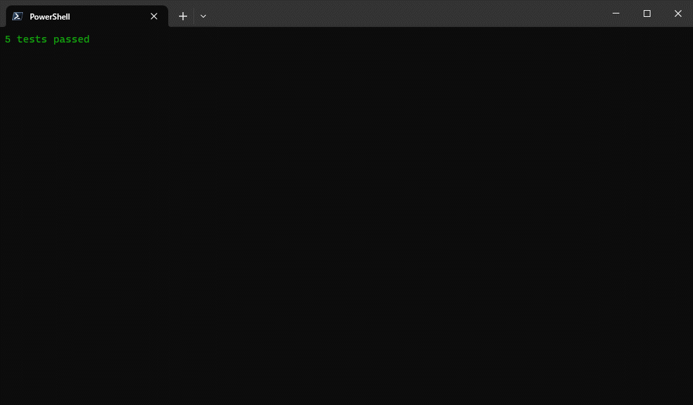

---

### borders — 边框样式

**ink 原版用法**: 多个 `<Box borderStyle="...">` 嵌套展示

**jink 实现要点**:
- `Ink.renderOnce(build(), 80, 24)` — 静态一次性渲染
- 展示 `SINGLE / DOUBLE / ROUND / BOLD / SINGLE_DOUBLE / DOUBLE_SINGLE / CLASSIC / ARROW` 八种边框

**运行**:
```powershell
.\scripts\run-demo.ps1 io.mybatis.jink.demo.BordersDemo
```

**效果**:
```


  ┌──────┐  ╔══════╗  ╭─────╮  ┏━━━━┓
  │single│  ║double║  │round│  ┃bold┃
  └──────┘  ╚══════╝  ╰─────╯  ┗━━━━┛

  ╓────────────╖  ╒════════════╕  +-------+  ↘↓↓↓↓↓↙
  ║singleDouble║  │doubleSingle│  |classic|  →arrow←
  ╙────────────╜  ╘════════════╛  +-------+  ↗↑↑↑↑↑↖
```
---

### box-backgrounds — 背景色

**ink 原版用法**: `backgroundColor` 属性 + 固定 `width/height`

**jink 实现要点**:
- `Box.backgroundColor(Color.RED/BLUE/GREEN/...)`
- `Color.hex("FF8800")`, `Color.rgb(0, 255, 0)` 真彩色
- 嵌套 Box 背景色继承/覆盖

**运行**:
```powershell
.\scripts\run-demo.ps1 io.mybatis.jink.demo.BoxBackgroundsDemo
```

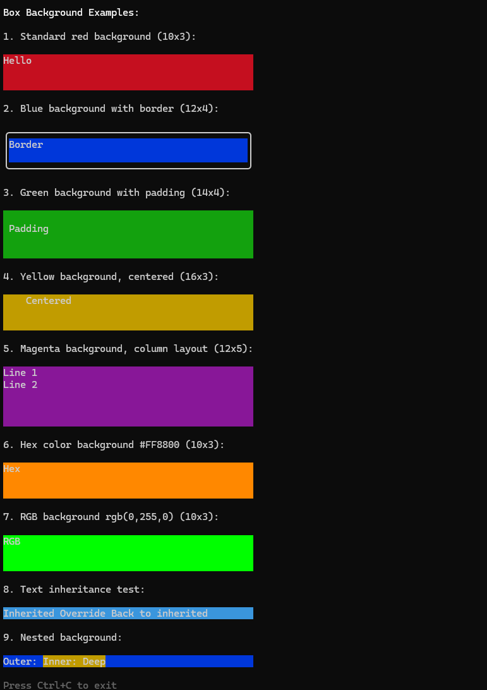

---

### justify-content — 内容对齐

**ink 原版用法**: `<Box justifyContent="flex-start|flex-end|center|space-around|space-between|space-evenly">`

**jink 实现要点**:
- `Box.of(Text.of("X"), Text.of("Y")).justifyContent(JustifyContent.XXX).width(20).height(1)`
- 每行括号内展示 X/Y 分布效果

**运行**:
```powershell
.\scripts\run-demo.ps1 io.mybatis.jink.demo.JustifyContentDemo
```

**效果**:
```
[XY                  ] flex-start
[                  XY] flex-end
[         XY         ] center
[    X         Y     ] space-around
[X                  Y] space-between
[      X      Y      ] space-evenly
```

---

### use-input — 键盘输入

**ink 原版用法**: `useInput((input, key) => { ... })`

**jink 实现要点**:
- 重写 `onInput(String input, Key key)` 方法
- `key.leftArrow()` / `key.rightArrow()` / `key.upArrow()` / `key.downArrow()`
- 按 `q` 调用 `System.exit(0)` 退出

**运行**:
```powershell
.\scripts\run-demo.ps1 io.mybatis.jink.demo.UseInputDemo
```

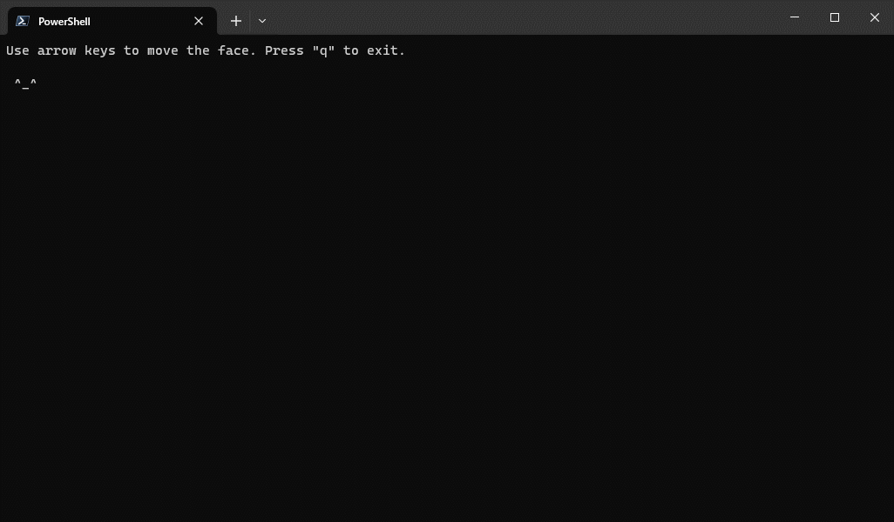

---

### terminal-resize — 终端尺寸

**ink 原版用法**: `const { columns, rows } = useWindowSize()`

**jink 实现要点**:
- `getColumns()` / `getRows()` — 框架在终端 resize 时自动更新，触发重渲染
- 组件使用 `Component<Void>` — 无需状态，直接读取终端尺寸

**运行**:
```powershell
.\scripts\run-demo.ps1 io.mybatis.jink.demo.TerminalResizeDemo
```

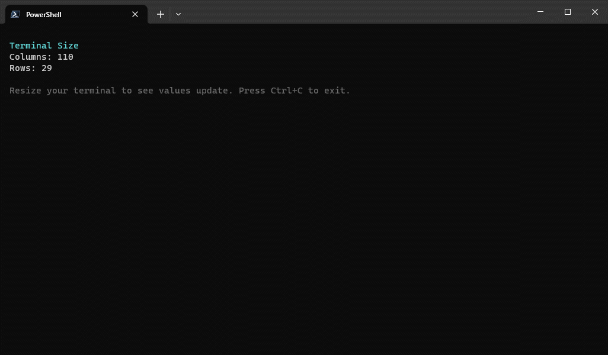

---

### static — 静态增量渲染

**ink 原版用法**: `<Static items={tests}>{test => <Box>...</Box>}</Static>`

**jink 实现要点**:
- `Static.<String>of(items, previousCount).render((item, idx) -> ...)` — 只渲染新增条目
- 状态中需额外保存 `previousCount`（渲染前的 items 数量）
- 已输出的行不会被覆盖，每次只追加新内容

**运行**:
```powershell
.\scripts\run-demo.ps1 io.mybatis.jink.demo.StaticDemo
```

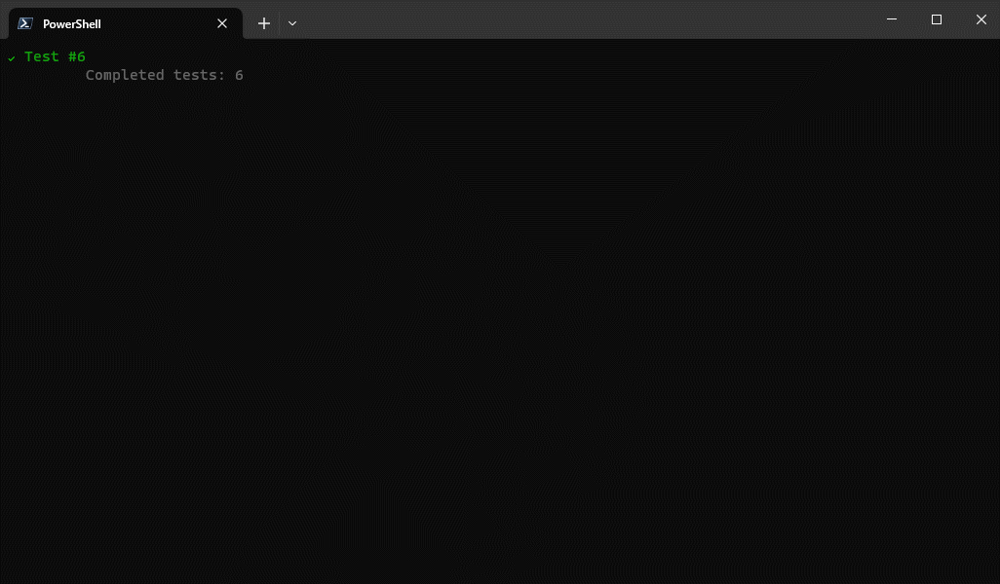

---

### incremental-rendering — 高频渲染

**ink 原版用法**: 多个 `setInterval` 同时更新多个状态（~60fps）

**jink 实现要点**:
- 单个 `ScheduledExecutorService` 每 16ms 更新三个进度条 + 随机日志行 + 计数器
- `onInput` 处理上下键选择服务列表

**运行**:
```powershell
.\scripts\run-demo.ps1 io.mybatis.jink.demo.IncrementalRenderingDemo
```

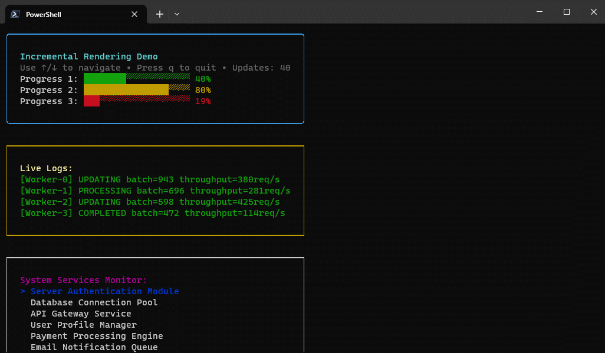

---

### chat — 聊天输入框

**ink 原版用法**: `useInput` 逐字符累积输入，Enter 发送

**jink 实现要点**:
- `onInput` 中判断 `key.return_()` / `key.backspace()` / `key.delete()`
- 普通字符追加到 input 字符串

**运行**:
```powershell
.\scripts\run-demo.ps1 io.mybatis.jink.demo.ChatDemo
```

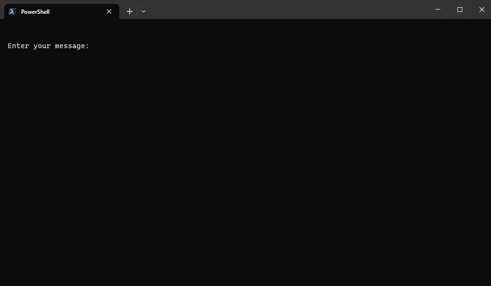

---

### use-focus — 焦点导航

**ink 原版用法**: `useFocus()` hook，多个子组件各自持有焦点状态

**jink 实现要点**:
- jink 不支持子组件独立焦点注册，使用状态 `focusIndex` 模拟
- ⚠️ jink 框架内部拦截 Tab 键用于内置焦点管理，Tab 不会到达 `onInput`
- 改用 `key.upArrow()` / `key.downArrow()` 实现焦点移动
- `key.escape()` → 重置焦点（`focusIndex = -1`）

**运行**:
```powershell
.\scripts\run-demo.ps1 io.mybatis.jink.demo.UseFocusDemo
```

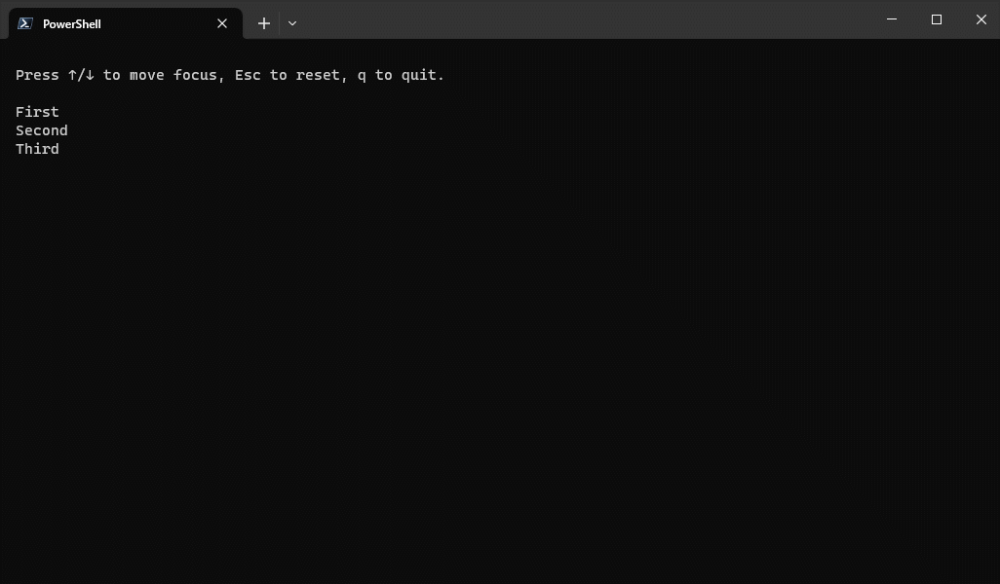

---

### table — 表格布局

**ink 原版用法**: 使用百分比宽度 Box 模拟列（`width="10%"` 等）

**jink 实现要点**:
- 使用固定 `width(8/40/32)` 列宽（jink 尚未支持百分比列宽）
- 静态数据，使用 `Ink.renderOnce()`

**运行**:
```powershell
.\scripts\run-demo.ps1 io.mybatis.jink.demo.TableDemo
```

**效果**:
```
ID      Name                                    Email
0       alice_dev                               alice@example.com
1       bob_builder                             bob@example.com
2       carol_qi                                carol@example.com
3       david_ops                               david@example.com
4       eve_sec                                 eve@example.com
5       frank_data                              frank@example.com
6       grace_ux                                grace@example.com
7       henry_ml                                henry@example.com
8       iris_cloud                              iris@example.com
9       jack_mobile                             jack@example.com
```


---

### jest — 测试运行器模拟

**ink 原版用法**: `PQueue` 并发队列 + `Static` 已完成测试 + 运行中测试动态显示

**jink 实现要点**:
- `ScheduledExecutorService(4 threads)` + `Semaphore(4)` 模拟并发限制
- `Static.<TestResult>of(completed, prevCount)` 永久输出已完成测试
- 汇总行（passed/failed/time）实时更新

**运行**:
```powershell
.\scripts\run-demo.ps1 io.mybatis.jink.demo.JestDemo
```

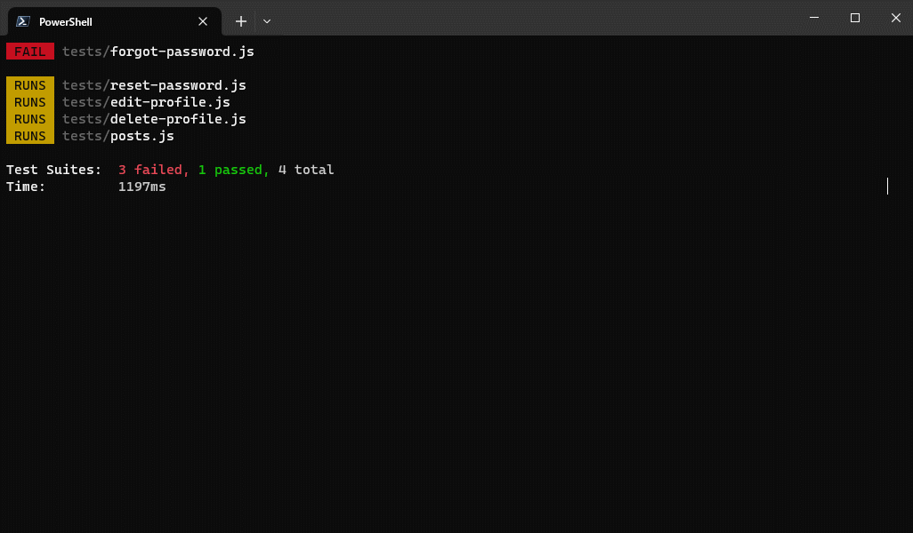

---

### subprocess-output — 子进程输出

**ink 原版用法**: `child_process.spawn('npm', [...])` + stdout 流监听

**jink 实现要点**:
- `ProcessBuilder("java", "-version")` + `redirectErrorStream(true)`
- 在后台线程读取输出，`setState` 触发重渲染

**运行**:
```powershell
.\scripts\run-demo.ps1 io.mybatis.jink.demo.SubprocessOutputDemo
```

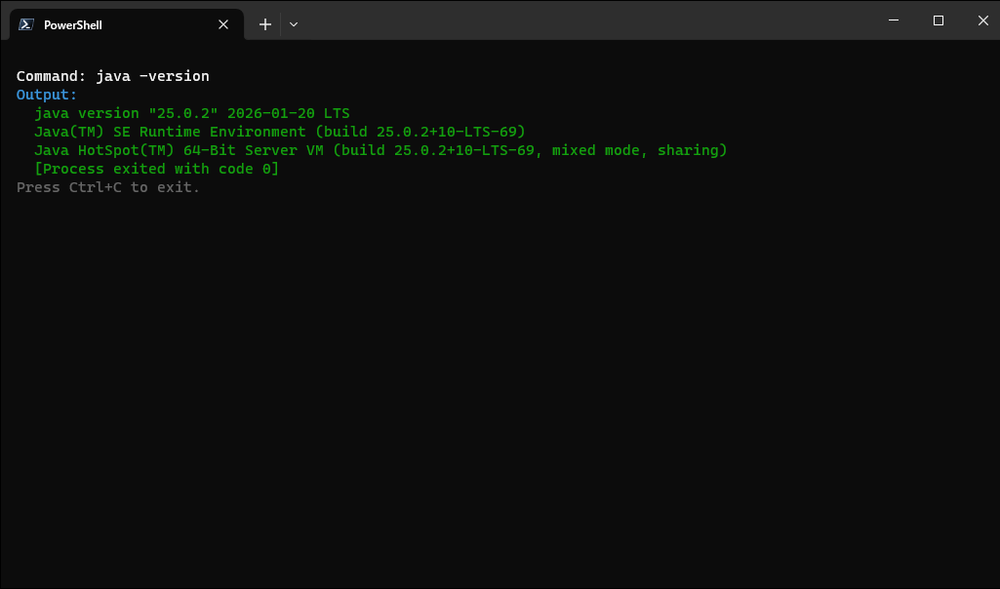

---

### router — 路由状态机

**ink 原版用法**: `react-router` 的 `MemoryRouter` + `useNavigate`

**jink 实现要点**:
- `enum Page { HOME, ABOUT }` + 状态机
- Enter 在页面间切换，q 退出
- 无需第三方路由库

**运行**:
```powershell
.\scripts\run-demo.ps1 io.mybatis.jink.demo.RouterDemo
```

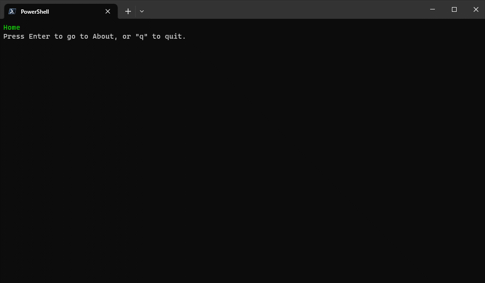

---

### select-input — 列表选择

**ink 原版用法**: `useInput` + `useState`（含 `useIsScreenReaderEnabled` ARIA 支持）

**jink 实现要点**:
- 上下键导航，Enter 确认，q 退出
- jink 不支持 ARIA / 屏幕阅读器功能，此部分略去

**运行**:
```powershell
.\scripts\run-demo.ps1 io.mybatis.jink.demo.SelectInputDemo
```

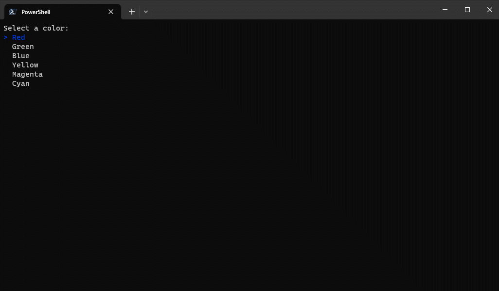

---

### cursor-ime — IME 光标定位

**ink 原版用法**: `useCursor` + `stringWidth` 计算光标列

**jink 实现要点**:
- `setCursorPosition(row, col)` — 在 `render()` 中调用设置光标
- 内置宽字符检测（CJK/emoji 占 2 列）
- 正确处理 surrogate pair（`codePointBefore`）

**运行**:
```powershell
.\scripts\run-demo.ps1 io.mybatis.jink.demo.CursorImeDemo
```


---

## 无法实现的示例

| 示例 | 原因 |
|:-----|:-----|
| `suspense` | React Suspense 是 React 特有概念，无 Java 等效 |
| `concurrent-suspense` | React 并发模式无 Java 等效 |
| `aria` | ARIA 辅助功能元数据暂不支持 |
| `use-transition` | React useTransition 无 Java 等效 |
| `select-input`（完整） | ARIA 数字快捷选择暂不支持（核心功能已实现）|
| `use-stdout` / `use-stderr` | Java `System.out` / `System.err` 直接可用，无需封装 |
| `render-throttle` | jink 内部已做渲染节流，无需单独示例 |
| `use-focus-with-id` | jink 当前不支持子组件独立焦点 ID 注册 |
| `alternate-screen` | jink 默认使用备用屏幕，无需示例 |

---

## 功能对照表（ink vs jink）

| 功能 | ink (TypeScript) | jink (Java) |
|:-----|:----------------|:------------|
| 声明式 UI | JSX | Builder API (`Box.of(...)`, `Text.of(...)`) |
| 状态管理 | `useState` Hook | `Component.setState()` |
| 副作用 | `useEffect` Hook | `onMount()` / `onUnmount()` |
| 输入处理 | `useInput` Hook | `onInput(String, Key)` 方法 |
| 终端尺寸 | `useWindowSize()` | `getColumns()` / `getRows()` |
| 光标定位 | `useCursor` | `setCursorPosition(row, col)` |
| Flexbox 布局 | Yoga (C++) | 纯 Java 实现 |
| 颜色 | chalk | 内置 `Color` 类（16色/256色/RGB/Hex）|
| 边框 | boxen 风格 | 8 种 `BorderStyle` |
| 焦点管理 | `useFocus` | `FocusManager` + `Focusable` 接口 |
| 静态内容 | `<Static items>` | `Static.<T>of(items, prevCount).render(...)` |
| 文本换行 | wrap-ansi | 内置 `TextWrap` |
| CJK 宽度 | string-width | 内置宽字符计算 |
| 终端控制 | 自动 | JLine 3 |
| 最低版本 | Node.js 18+ | Java 8+ |

---

## 原有 Demo 详解

### FeatureShowcase — 综合功能展示

### 展示功能
- ✅ 4 标签页多视图切换
- ✅ **Tab 1 - 布局**：flexDirection(ROW/COLUMN)、justifyContent、alignItems、flexWrap、gap、百分比宽度、Spacer
- ✅ **Tab 2 - 样式**：文本效果(粗体/斜体/下划线/删除线/暗淡/反转)、16色/256色/RGB 色彩、8种边框样式、每边独立边框色、textWrap 截断(END/MIDDLE/START)
- ✅ **Tab 3 - 交互**：setState 计数器、按键事件实时显示(键名/输入/修饰键)、patchConsole 实际拦截演示
- ✅ **Tab 4 - 高级**：Transform 文本变换、overflow:hidden 裁剪、position:absolute 绝对定位、Newline 内联换行、Static 增量内容

### 运行步骤

```powershell
.\scripts\run-demo.ps1 io.mybatis.jink.demo.FeatureShowcase
```

<table style="width:80%">
  <tr>
    <td>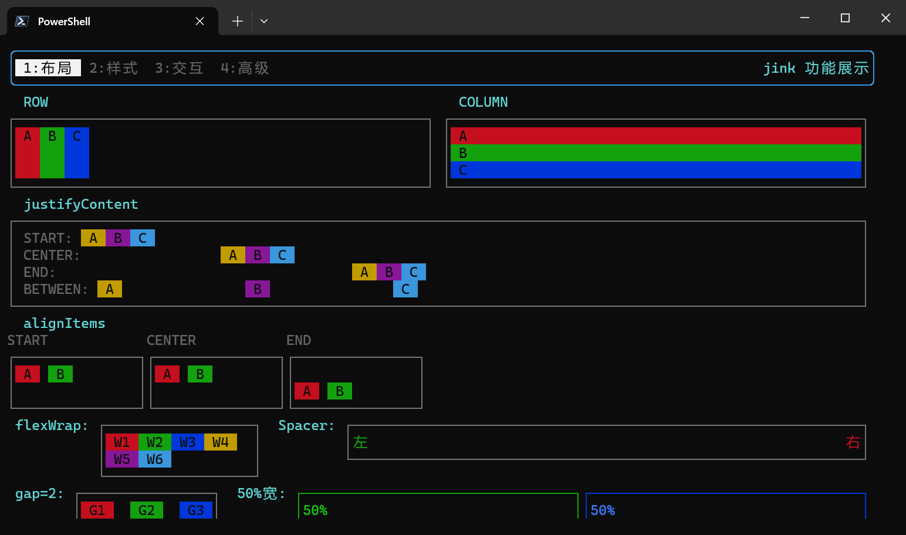</td>
    <td>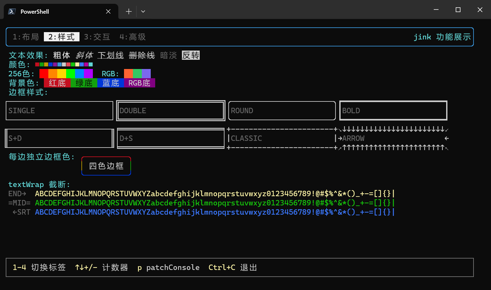</td>
  </tr>
  <tr>
    <td>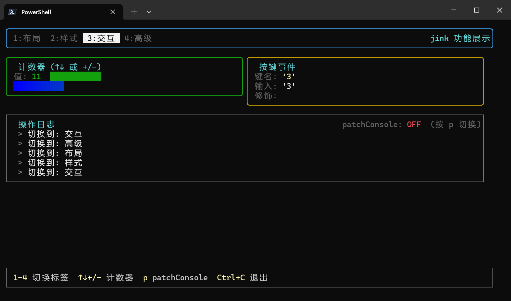</td>
    <td>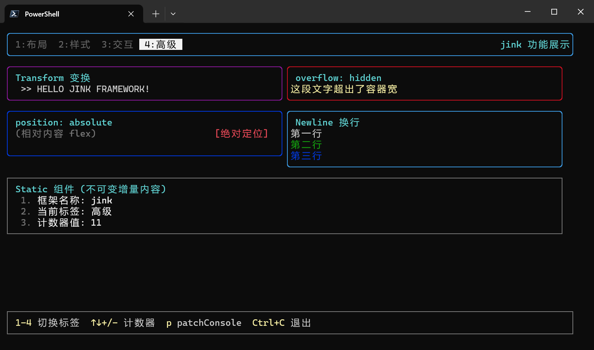</td>
  </tr>
</table>

### 快捷键

| 按键 | 功能 |
|:-----|:-----|
| `1` / `2` / `3` / `4` | 切换标签页 |
| `↑` / `↓` / `+` / `-` | Tab 3 计数器加减 |
| `p` | Tab 3 开关 patchConsole（拦截 System.out/err） |
| `Ctrl+C` | 退出 |

### 核心代码片段

```java
public class FeatureShowcase extends Component<FeatureShowcase.State> {

    static final class State {
        final int tab;
        final int counter;
        final String lastKeyName;
        final List<String> logs;
        final boolean consolePatched;
        final List<String> interceptedLogs;
        // ... 构造器/getter 省略
    }

    @Override
    public Renderable render() {
        int w = getColumns() > 0 ? getColumns() : 80;
        int h = getRows() > 0 ? getRows() : 24;
        return Box.of(
                renderHeader(w),
                renderBody(w, h - 6),
                renderFooter(w)
        ).flexDirection(FlexDirection.COLUMN)
                .width(w).height(h);
    }

    @Override
    public void onInput(String input, Key key) {
        // 标签切换：1-4
        if ("p".equals(input) && getState().tab() == 2) {
            // 实际启用 / 关闭 patchConsole
            if (!getState().consolePatched()) {
                ConsolePatcher.patch(text -> {
                    // 拦截到输出，更新 state 显示
                    setState(...);
                });
            } else {
                ConsolePatcher.restore();
            }
        }
    }
}
```

---

### SimpleDemo — 静态渲染
### 展示功能
- ✅ 圆角边框 (BorderStyle.ROUND)
- ✅ 边框着色 (borderColor)
- ✅ 文本颜色（多种 ANSI 颜色）
- ✅ 文本样式（bold, italic, dimmed, inverse）
- ✅ Flexbox 垂直布局 (COLUMN)
- ✅ Flexbox 水平布局（嵌套面板）
- ✅ padding/gap 间距
- ✅ flexGrow 弹性分配
- ✅ RGB 真彩色
- ✅ `renderToString` / `renderOnce` API

### 运行步骤

```powershell
.\scripts\run-demo.ps1 io.mybatis.jink.demo.SimpleDemo
```

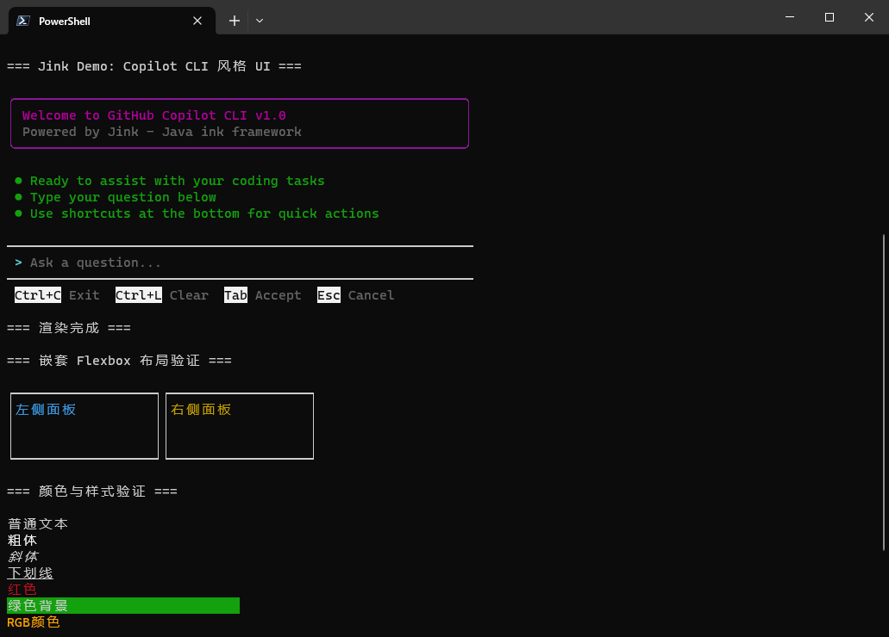

### 核心代码片段

```java
// 欢迎框（圆角洋红色边框）
Box.of(
    Text.of("Welcome to GitHub Copilot CLI v1.0")
        .color(Color.MAGENTA).bold(),
    Text.of("Powered by Jink - Java ink framework").dimmed()
).flexDirection(FlexDirection.COLUMN)
 .borderStyle(BorderStyle.ROUND)
 .borderColor(Color.MAGENTA)
 .paddingX(1);

// 嵌套面板布局
Box.of(
    Box.of(Text.of("左侧面板").color(Color.CYAN))
        .flexGrow(1).borderStyle(BorderStyle.SINGLE).height(5),
    Box.of(Text.of("右侧面板").color(Color.YELLOW))
        .flexGrow(1).borderStyle(BorderStyle.SINGLE).height(5)
).width(40).height(5);

// 颜色样式
Box.of(
    Text.of("普通文本"),
    Text.of("粗体").bold(),
    Text.of("斜体").italic(),
    Text.of("红色").color(Color.RED),
    Text.of("RGB颜色").color(Color.rgb(255, 165, 0))
).flexDirection(FlexDirection.COLUMN);
```

---

### InteractiveDemo — 键盘交互

### 展示功能
- ✅ 有状态组件 (Component\<State\>)
- ✅ 实时键盘输入 (onInput)
- ✅ setState 驱动重渲染
- ✅ 消息列表动态更新
- ✅ 方向键导航选择
- ✅ 快捷键提示栏（inverse 反色样式）
- ✅ 备用屏幕缓冲区（退出后终端干净）

### 运行步骤

```powershell
.\scripts\run-demo.ps1 io.mybatis.jink.demo.InteractiveDemo
```

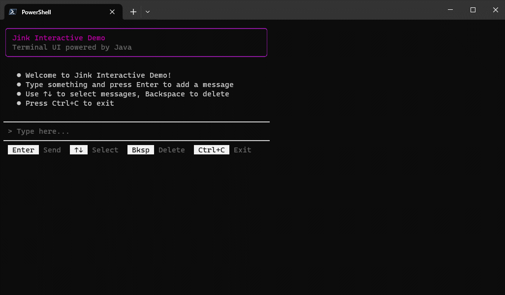

### 核心代码片段

```java
public class InteractiveDemo extends Component<InteractiveDemo.State> {
    record State(String inputText, int cursorPos,
                 List<String> messages, int selectedIndex) {}

    @Override
    public Renderable render() {
        // 高亮选中项
        if (selected) {
            Text.of("▶ " + msg).color(Color.CYAN).bold();
        } else {
            Text.of("  " + msg).color(Color.WHITE);
        }
    }

    @Override
    public void onInput(String input, Key key) {
        if (key.return_()) {
            // 添加消息
        } else if (key.upArrow()) {
            // 选择上一条
        }
    }
}
```

---

### CopilotDemo — 完整复刻

### 展示功能
- ✅ 全屏 Copilot CLI 界面
- ✅ 圆角标题框（洋红色边框 + 版本信息 + Tips）
- ✅ 消息列表（虚拟滚动）
- ✅ 弹性空白区 (Spacer)
- ✅ 状态栏（左: 路径, 右: 模型信息）
- ✅ 输入框（提示符 ❯ + placeholder）
- ✅ 水平分隔线
- ✅ 底部快捷键栏
- ✅ 多行输入 (Shift+Enter)
- ✅ 输入历史 (↑↓)
- ✅ 消息滚动 (鼠标滚轮/PageUp/PageDown)
- ✅ CJK 字符光标位置正确
- ✅ Ctrl+C 优雅退出
- ✅ 终端尺寸自适应

### 运行步骤

```powershell
.\scripts\run-demo.ps1 io.mybatis.jink.demo.CopilotDemo
```

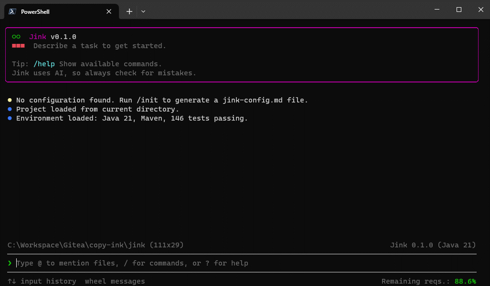

### 快捷键总结

| 按键 | 功能 |
|:-----|:-----|
| `Enter` | 发送消息 |
| `Alt+Enter` | 多行输入换行 |
| `Backspace` | 删除字符 |
| `↑` / `↓` | 输入框命令历史 |
| 鼠标滚轮 | 滚动中间消息历史（每次 3 行） |
| `PageUp` / `PageDown` | 快速滚动消息历史（每次 10 行） |
| `Ctrl+C` | 退出 |

### 核心代码片段

```java
public class CopilotDemo extends Component<CopilotDemo.State> {
    record State(String inputText, List<String> messages, int scrollOffset) {}

    @Override
    public Renderable render() {
        return Box.of(
            headerBox(w),           // 圆角标题框
            statusMessages(s, max), // 消息列表（虚拟滚动）
            Spacer.create(),        // 弹性空白
            statusBar(w, h),        // 状态栏
            separator(w),           // 分隔线
            inputArea(s, w),        // 输入区（❯ 提示符）
            separator(w),           // 分隔线
            shortcutBar(w)          // 快捷键栏
        ).flexDirection(FlexDirection.COLUMN).width(w).height(h);
    }
}
```

---

### CopilotDemoPreview — 静态预览

### 展示功能
- ✅ 无需 raw mode 的渲染测试
- ✅ 自定义终端尺寸
- ✅ 调试输出（行号 + 内容预览）

### 运行步骤

```powershell
.\scripts\run-demo.ps1 io.mybatis.jink.demo.CopilotDemoPreview
```

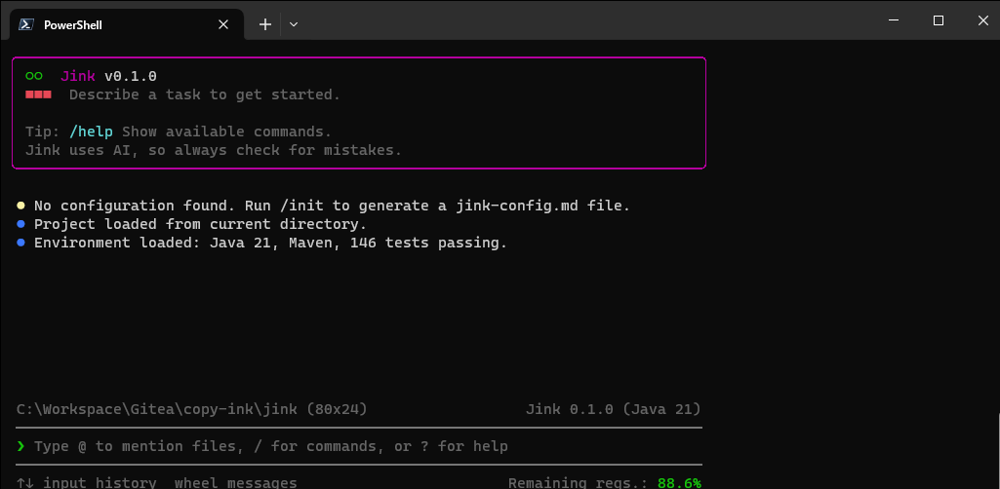

---

### PromptDemo — 选项列表 + 自由输入

### 展示功能
- ✅ 单线边框包裹整个组件
- ✅ 带编号的选项列表，`❯` 青色高亮当前项
- ✅ `↑` / `↓` 键导航选择
- ✅ Enter 确认，Esc 取消
- ✅ 「Other (type your answer)」切换文本输入模式
- ✅ 输入模式：逐字符累积 + Backspace 删除 + Enter 提交 + Esc 返回选择
- ✅ 确认后显示 `✔` 绿色结果并自动退出

### 运行步骤

```powershell
.\scripts\run-demo.ps1 io.mybatis.jink.demo.PromptDemo
```

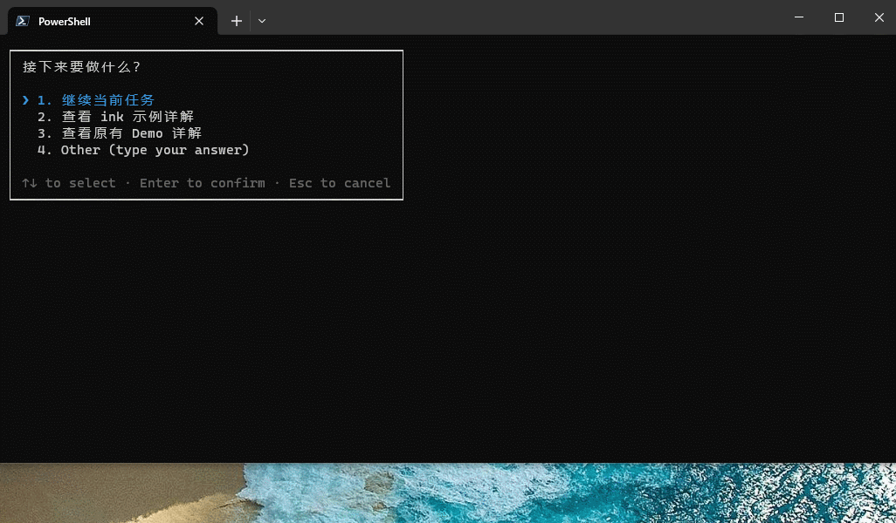

### 键盘操作

| 按键 | 功能 |
|:-----|:-----|
| `↑` / `↓` | 上下移动选择 |
| `Enter` | 确认当前选项（若为 Other 则进入输入模式） |
| `Esc` | 取消退出（选择模式）/ 返回选择模式（输入模式） |
| 任意字符 | 输入模式下累积字符 |
| `Backspace` | 输入模式下删除最后一个字符 |

### 核心代码片段

```java
public class PromptDemo extends Component<PromptDemo.State> {

    enum Mode { SELECT, INPUT, DONE }

    record State(int selectedIndex, Mode mode, String inputText, String result) {}

    @Override
    public Renderable render() {
        State s = getState();
        // Build options with ❯ indicator
        Box optionList = Box.of().flexDirection(FlexDirection.COLUMN).marginTop(1);
        for (int i = 0; i < options.size(); i++) {
            boolean isSelected = i == s.selectedIndex();
            boolean isOther = options.get(i).equals(OTHER_LABEL);

            if (isSelected && isOther && s.mode() == Mode.INPUT) {
                // Show cursor in input mode
                optionList.add(Box.of(
                    Text.of("❯ " + (i+1) + ". ").color(Color.CYAN),
                    Text.of(s.inputText() + "█").color(Color.CYAN)
                ).flexDirection(FlexDirection.ROW));
            } else {
                String label = (isSelected ? "❯ " : "  ") + (i+1) + ". " + options.get(i);
                optionList.add(Text.of(label).color(isSelected ? Color.CYAN : null));
            }
        }
        return Box.of(
            Text.of(question),
            optionList,
            Box.of(Text.of("↑↓ to select · Enter to confirm · Esc to cancel").dimmed()).marginTop(1)
        ).flexDirection(FlexDirection.COLUMN)
         .borderStyle(BorderStyle.SINGLE)
         .paddingX(1);
    }

    @Override
    public void onInput(String input, Key key) {
        State s = getState();
        if (s.mode() == Mode.INPUT) {
            if (key.return_() && !s.inputText().isEmpty()) confirmAndExit(s.inputText());
            else if (key.escape())    setState(new State(s.selectedIndex(), Mode.SELECT, "", null));
            else if (key.backspace()) setState(new State(s.selectedIndex(), Mode.INPUT,
                    s.inputText().substring(0, s.inputText().length() - 1), null));
            else if (!input.isEmpty() && !key.ctrl())
                setState(new State(s.selectedIndex(), Mode.INPUT, s.inputText() + input, null));
        } else {
            if (key.upArrow())    setState(new State((s.selectedIndex() - 1 + options.size()) % options.size(), Mode.SELECT, "", null));
            else if (key.downArrow()) setState(new State((s.selectedIndex() + 1) % options.size(), Mode.SELECT, "", null));
            else if (key.return_()) {
                if (options.get(s.selectedIndex()).equals(OTHER_LABEL))
                    setState(new State(s.selectedIndex(), Mode.INPUT, "", null));
                else confirmAndExit(options.get(s.selectedIndex()));
            } else if (key.escape()) System.exit(0);
        }
    }
}
```

### 颜色系统完整演示

```java
// 16 色基本色
Color.BLACK, Color.RED, Color.GREEN, Color.YELLOW,
Color.BLUE, Color.MAGENTA, Color.CYAN, Color.WHITE

// 16 色亮色
Color.BRIGHT_BLACK, Color.BRIGHT_RED, Color.BRIGHT_GREEN,
Color.BRIGHT_YELLOW, Color.BRIGHT_BLUE, Color.BRIGHT_MAGENTA,
Color.BRIGHT_CYAN, Color.BRIGHT_WHITE

// 256 色
Color.ansi256(196)  // 亮红
Color.ansi256(208)  // 橙色
Color.ansi256(226)  // 亮黄

// RGB 真彩色
Color.rgb(255, 0, 0)     // 红
Color.rgb(0, 255, 0)     // 绿
Color.hex("#FF6347")      // 番茄红
Color.hex("4169E1")       // 皇家蓝
```

### 边框样式完整演示

```java
// 所有可用边框
BorderStyle.SINGLE          // ┌─┐│└─┘
BorderStyle.DOUBLE          // ╔═╗║╚═╝
BorderStyle.ROUND           // ╭─╮│╰─╯
BorderStyle.BOLD            // ┏━┓┃┗━┛
BorderStyle.SINGLE_DOUBLE   // ╓─╖║╙─╜
BorderStyle.DOUBLE_SINGLE   // ╒═╕│╘═╛
BorderStyle.CLASSIC         // +--+|+--+
BorderStyle.ARROW           // ↘↓↙←↗↑↖→
```

### Flexbox 对齐方式演示

```java
// justifyContent 示例（水平分布）
Box.of(a, b, c).justifyContent(JustifyContent.SPACE_BETWEEN)
// [a         b         c]

Box.of(a, b, c).justifyContent(JustifyContent.CENTER)
// [      a  b  c      ]

// alignItems 示例（垂直对齐）
Box.of(tall, short_).alignItems(AlignItems.CENTER)
// tall 居中对齐 short_
```

---

### TopDemo — 系统监控 TUI

### 展示功能
- ✅ **系统 CPU 进度条**：实时 CPU 使用率（来自 `com.sun.management.OperatingSystemMXBean`），颜色告警（绿/黄/红）
- ✅ **系统内存进度条**：物理内存使用率（总量/已用，单位 GB）
- ✅ **JVM 堆进度条**：当前 JVM 堆内存使用（已用/最大，单位 MB）
- ✅ **线程数进度条**：JVM 活跃线程计数
- ✅ **进程列表**：跨平台进程名、PID、内存（Linux: `ps`，macOS: `ps`，Windows: `tasklist`）
- ✅ **可排序列**：按 CPU%（默认）/ MEM / PID / 名称排序，按键切换
- ✅ **实时搜索过滤**：`/` 键进入搜索模式，按进程名或 PID 过滤
- ✅ **键盘导航**：方向键、PageUp/Down、Home/End 快速定位
- ✅ **动态尺寸自适应**：终端 resize 即重排

> **注意**：Windows 平台进程级 CPU% 显示为 0%（系统整体 CPU% 正常）。
> 精确的进程级 CPU% 需要 Windows 性能计数器 API，超出了此 Demo 的范围。

### 运行步骤

```powershell
.\scripts\run-demo.ps1 io.mybatis.jink.demo.TopDemo
```

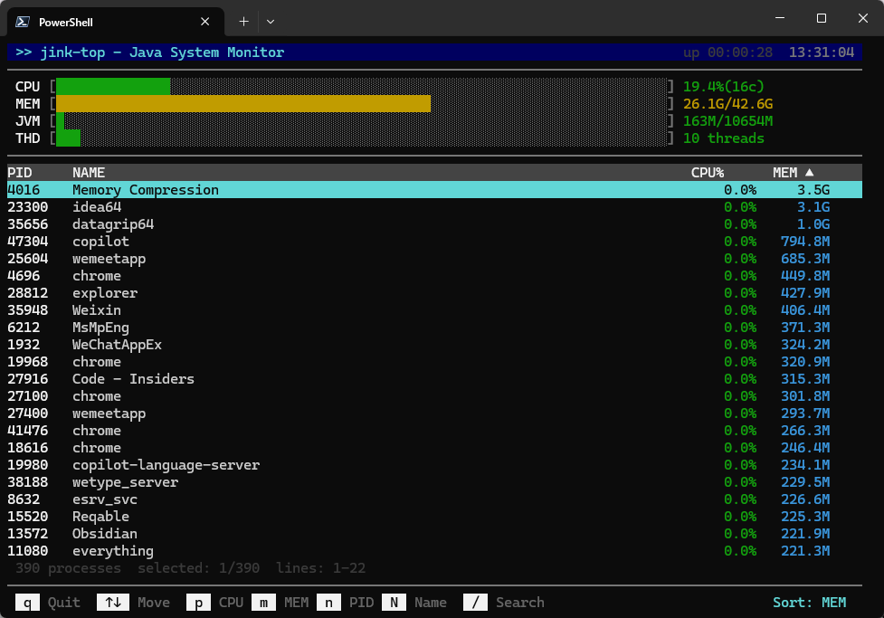

### 快捷键

| 按键 | 功能 |
|:-----|:-----|
| `q` | 退出 |
| `↑` / `↓` | 上下移动选中行 |
| `PageUp` / `PageDown` | 快速翻页（每次 10 行） |
| `Home` / `End` | 跳到第一行 / 最后一行 |
| `p` | 按 CPU% 排序 |
| `m` | 按内存排序 |
| `n` | 按 PID 排序 |
| `N` | 按进程名排序 |
| `/` | 进入搜索模式（实时过滤进程名/PID） |
| `ESC` | 清除搜索词 / 退出搜索输入 |
| `r` | 立即刷新进程列表 |
| 鼠标滚轮 | 上下滚动进程列表 |

### 核心代码片段

```java
public class TopDemo extends Component<TopDemo.AppState> {

    static final class AppState {
        final SystemInfo sysInfo;          // CPU%、内存、JVM堆、线程数
        final List<ProcessInfo> processes; // 进程列表
        final int selectedIndex;
        final SortField sortField;
        final String searchQuery;
        final boolean searchMode;
    }

    @Override
    public void onMount() {
        // 每秒刷新 CPU + 进程列表
        scheduler.scheduleAtFixedRate(() -> refresh(), 0, 1, TimeUnit.SECONDS);
        // 每5秒刷新内存（跨平台命令较慢）
        scheduler.scheduleAtFixedRate(() -> refreshMemory(), 0, 5, TimeUnit.SECONDS);
    }

    private void refresh() {
        // 系统 CPU：com.sun.management.OperatingSystemMXBean
        double cpuPct = extOsMBean.getSystemCpuLoad() * 100;
        // 跨平台进程列表
        List<ProcessInfo> procs = collectProcesses(); // ps / tasklist
        setState(new AppState(sysInfo, procs, ...));
    }
}
```

---

### MazeDemo — 控制台迷宫游戏

### 展示功能
- ✅ **自适应尺寸**：迷宫大小自动适配终端尺寸（`logicRows = (h-5)/2, logicCols = (w-2)/2`），resize 即重新生成
- ✅ **随机化 Prim 算法**：生成完美迷宫（无环路），密集分支、多死胡同，难度高于 DFS
- ✅ **玩家移动**：方向键或 WASD 控制玩家 `@`，从左上角(0,0)移动到右下角出口 `E`
- ✅ **移动轨迹**：前进路径（绿色 `·`），回退路径（灰色 `·`），实时更新
- ✅ **完美迷宫路径判断**：利用无环特性，走廊颜色判断唯一正确
- ✅ **通关检测**：到达出口显示成功画面 + 路径步数统计
- ✅ **快捷键**：`r` 重新生成、`q` 退出

### 运行步骤

```powershell
.\scripts\run-demo.ps1 io.mybatis.jink.demo.MazeDemo
```

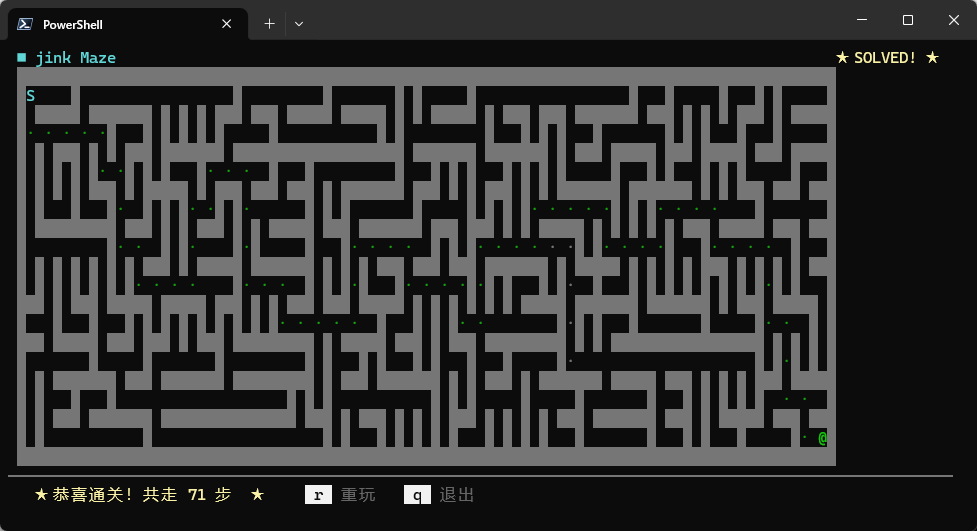

### 快捷键

| 按键 | 功能 |
|:-----|:-----|
| `↑` / `↓` / `←` / `→` | 移动玩家 |
| `W` / `A` / `S` / `D` | 移动玩家（WASD） |
| `r` | 重新生成迷宫（适应当前终端大小） |
| `q` / `Ctrl+C` | 退出 |

### 迷宫渲染格式

```
████████████████████
@  ·  ·           █
██ █████████████ ██
   ·              E
```

- `█` 墙壁（深灰）
- `@` 玩家（绿色/黄色闪光）
- `E` 出口（青色 + ROUND 边框）
- `·` 前进路径（绿色）/ 回退路径（灰色）

### 核心代码片段

```java
public class MazeDemo extends Component<MazeDemo.State> {

    static final class State {
        final boolean[][] grid;      // 平铺网格（true=墙）
        final int logicRows, logicCols;
        final int playerR, playerC;
        final List<int[]> pathHistory;
        final Set<Long> backtrackedSet;
        final boolean won;
    }

    @Override
    public Renderable render() {
        int w = getColumns() > 0 ? getColumns() : 80;
        int h = getRows() > 0 ? getRows() : 24;
        // Resize 检测：尺寸变化时重新生成迷宫
        int targetRows = (h - 5) / 2;
        int targetCols = (w - 2) / 2;
        if (targetRows != lastTargetRows || targetCols != lastTargetCols) {
            lastTargetRows = targetRows;
            lastTargetCols = targetCols;
            setState(buildState(targetRows, targetCols));
        }
        return Box.of(renderMaze(getState(), w), renderFooter(w))
                .flexDirection(FlexDirection.COLUMN).width(w).height(h);
    }

    // Prim 随机化算法生成迷宫
    private static State buildState(int rows, int cols) {
        boolean[][] grid = new boolean[rows * 2 + 1][cols * 2 + 1];
        // 初始化全为墙
        for (boolean[] row : grid) Arrays.fill(row, true);
        // 从 (0,0) 开始，随机扩展边界
        List<int[]> frontiers = new ArrayList<>();
        addFrontier(0, 0, grid, frontiers);
        while (!frontiers.isEmpty()) {
            int idx = (int)(Math.random() * frontiers.size());
            // ... 打通墙壁，扩展新边界
        }
        return new State(grid, rows, cols, 0, 0, new ArrayList<>(), new HashSet<>(), false);
    }
}
```

---
